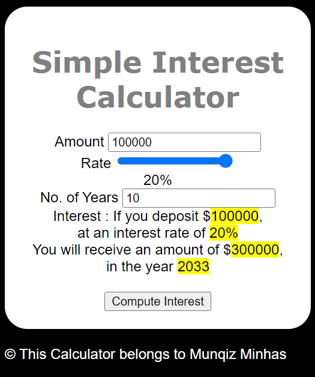

# Simple Interest Calculator Website
> I applied HTML, CSS, and JavaScript to design a website that calculates how much the user will recieve
  based on the investment amount, # of years invested, and the interest rate. This website was created as a 
  lab assignment for the Introduction to Web Development with HTML, CSS, JavaScript course offered by IBM 
  (which is course 2 of the IBM Full Stack Developer Professional Certification Program).

  

